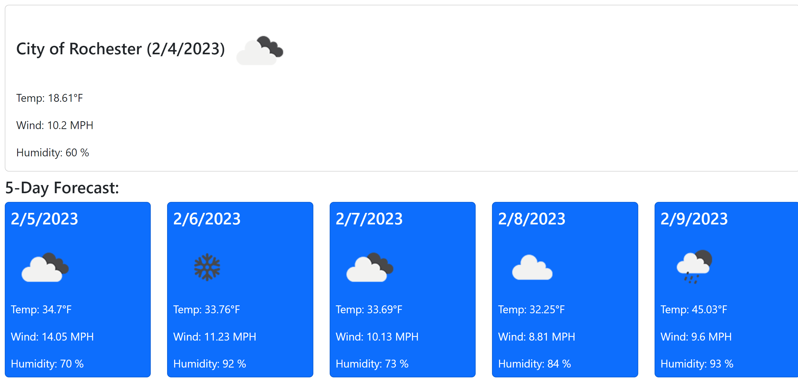

# 5 Day Weather Forecast
Challenge 6 - 5 day weather forecast dashboard

## Description

This project has been an ongoing challenge for me.  I've been able to learn more things during the bootcamp process and come back and have been able to put things into play.  One thing that I found while putting this project together, has been the different reference materials and the sites that help you play with your code.  I fell in love with the JASS site, there is a link below.  It was able to show me what I was doing, along with checking my code.  I was able to discover commas and semicolons that were missing with using this.  Also, where things weren't being called appropriately due to typos.  

For this project, the 5-Day-Forcast will allow you to search for your city, then display the weather for your current city and let you see what the weather will be for the following five days.  You will also be able to see what cities you previously searched and just click on them again in order to see what the weather is.  

## Links

* [5 Day Weather Forcast App](https://labeutler.github.io/5-day-weather-forecast/)
* [Personal GitHub Link](https://github.com/labeutler/5-day-weather-forecast)

### USER STORY 

AS A traveler 
I WANT to see the weather outlook for multiple cities 
SO THAT I can plan a trip accordingly 

***

### ACCEPTANCE CRITERIA 

GIVEN a weather dashboard with form inputs 
WHEN I search for a city 
THEN I am presented with current and future conditions for that city and that city is added to the search history 
WHEN I view current weather conditions for that city 
THEN I am presented with the city name, the date, an icon representation of weather conditions, the temperature, the humidity, and the wind speed 
WHEN I view future weather conditions for that city 
THEN I am presented with a 5-day forecast that displays the date, an icon representation of weather conditions, the temperature, the wind speed, and the humidity 
WHEN I click on a city in the search history 
THEN I am again presented with current and future conditions for that city 

## Installation

N/A

## Usage 

[Personal GitHub](https://github.com/labeutler/5-day-weather-forecast)

### I am presented with current and future conditions for that city and that city is added to the search history 

### I am presented with the city name, the date, an icon representation of weather conditions, the temperature, the humidity, and the wind speed  

#### I am presented with a 5-day forecast that displays the date, an icon representation of weather conditions, the temperature, the wind speed, and the humidity 

### I am again presented with current and future conditions for that city  

## Credits

* [Aside help](https://www.w3schools.com/tags/tag_aside.asp)
* [Timezone help](https://day.js.org/docs/en/plugin/timezone)
* [Adding lines](https://www.w3schools.com/tags/tag_hr.asp)
* [Aria assist](https://developer.mozilla.org/en-US/docs/Web/Accessibility/ARIA/Attributes/aria-controls)
* [History help](https://stackoverflow.com/questions/65768632/how-to-use-displayed-text-from-a-search-input-to-display-data-from-a-previous-se)
* [Card Help](https://stackoverflow.com/questions/66113154/addeventlistener-not-working-on-dynamic-dom)
* [Append Storage](https://javascript.info/localstorage)
* [Fetch Weather](https://openweathermap.org/forecast5#5days)
* [Weather Icon Help](https://stackoverflow.com/questions/44177417/how-to-display-openweathermap-weather-icon)
* [JASS site](https://codepen.io/Ephellon/pen/ojVjEz)

* Tutor = Chris Baird

## License

[MIT License](https://choosealicense.com/licenses/mit/)